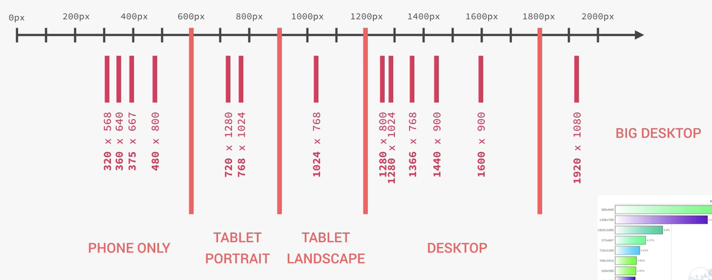
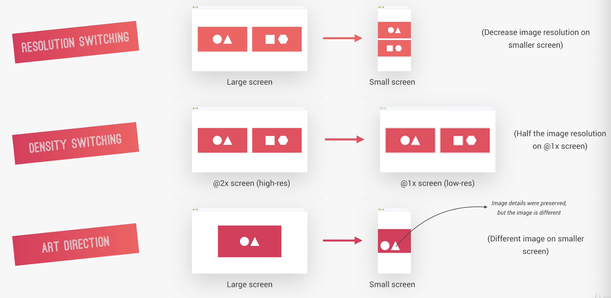
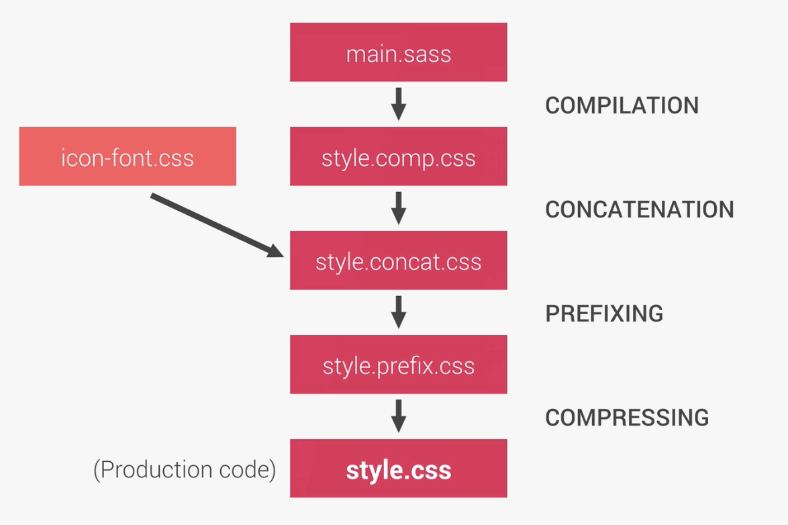
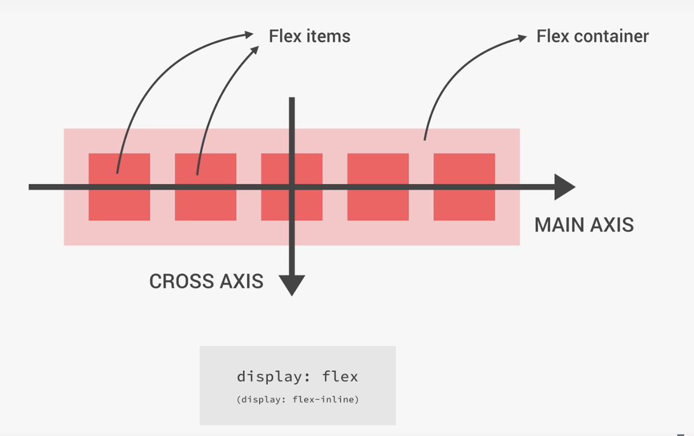
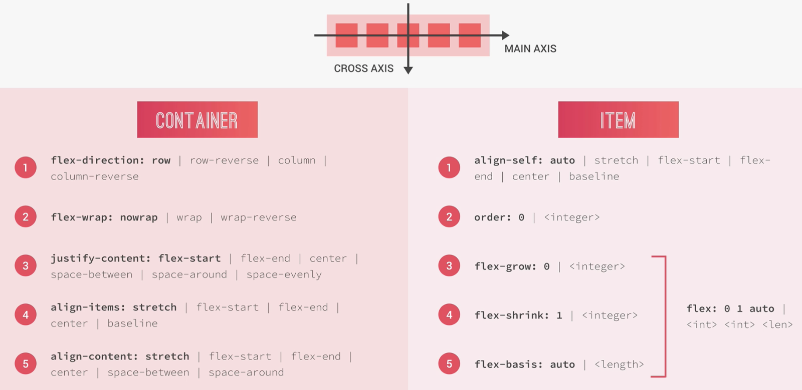
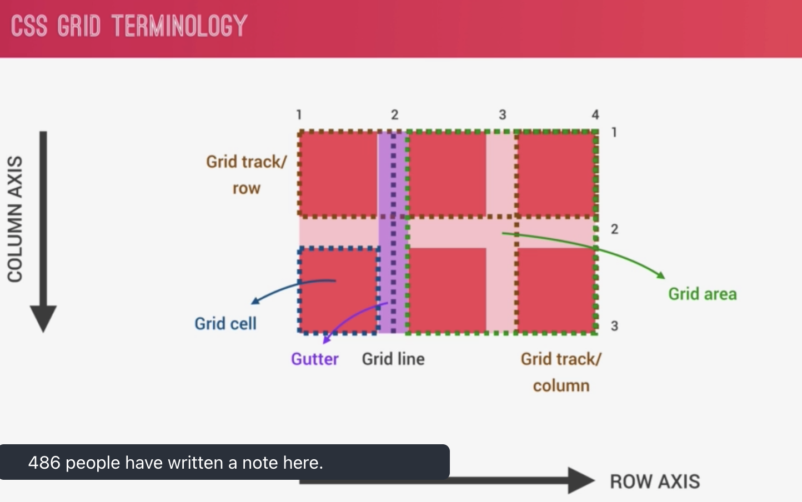
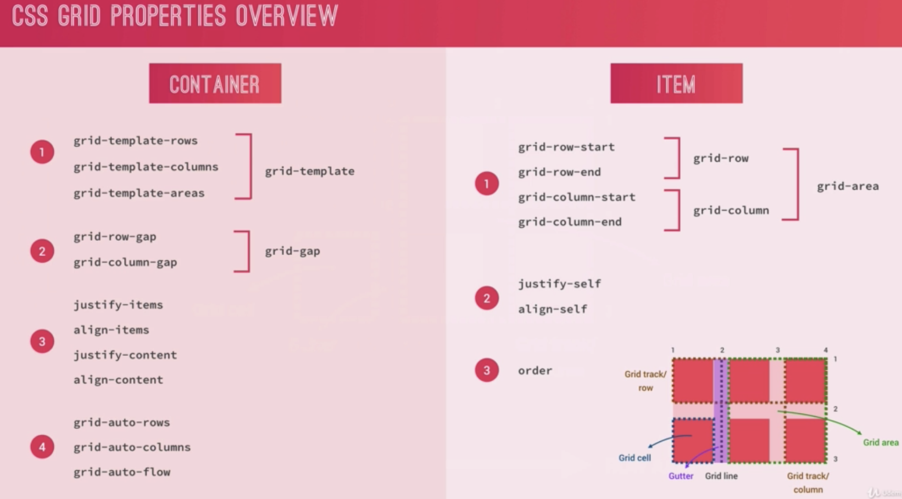

# Advanced CSS and Sass - Udemy

## By [Jonas Schmedtmann](https://www.udemy.com/course/advanced-css-and-sass/)

<h3 id='summary'>Summary</h3>

- [Advanced CSS and Sass - Udemy](#advanced-css-and-sass---udemy)
  - [By Jonas Schmedtmann](#by-jonas-schmedtmann)
    - [Normalize CSS](#normalize-css)
    - [Basic CSS](#basic-css)
          - [Background-image](#background-image)
          - [Clip-path](#clip-path)
          - [Keyframes Animations](#keyframes-animations)
        - [Three Pillars to Write Good HTML and CSS](#three-pillars-to-write-good-html-and-css)
    - [How CSS Works: behind the scenes](#how-css-works-behind-the-scenes)
    - [CSS Architecture Mindset](#css-architecture-mindset)
    - [SASS](#sass)
    - [Basic Responsive Design Principles](#basic-responsive-design-principles)
    - [Attribute Selectors](#attribute-selectors)
    - [Outline](#outline)
    - [Form Label Trick](#form-label-trick)
    - [Media Queries](#media-queries)
    - [Responsive images](#responsive-images)
    - [@supports](#supports)
    - [Setting a Simple Build Process](#setting-a-simple-build-process)
    - [Flexbox](#flexbox)
    - [SVG](#svg)
    - [CSS Grid Layout](#css-grid-layout)

### Normalize CSS

[Summary](#summary)

Reset the css to make every browser to have the same basic css as you want. Nowadays, the browsers are much better, so a simple reset is enough.

```css
* {
    margin: 0;
    padding: 0;
    box-sizing: border-box;
}
```

Note. Never put font related css into the universal selector `*`. Put it on the body.

### Basic CSS

[Summary](#summary)

###### Background-image

[Summary](#summary)

You can add multiple background images, for example an image on the bottom and a gradient on top. To do this use the `background-image` property and define from the top to the bottom. Ex: `background-image: linear-gradient(to right bottom, rgba(126, 213, 111, 0.8), rgba(40, 180, 133, 0.8)), url('../images/hero.jpg');`.

###### Clip-path

[Summary](#summary)

With `clip-path` you can create a geometrical form to clip your image with.
```
                    1    2    3    4
clip-path: polygon(x y, x y, x y, x y);
where: 
1 = top left corner
2 = top right corner
3 = bottom right corner
4 = bottom left corner
Ex. triangle => clip-path: polygon(50% 0, 100% 100%, 0 100%);
Ex2. clip-path: polygon(0 0, 100% 0, 100% 75vh , 0 100%);
```
You can check this website [Clippy](https://bennettfeely.com/clippy/) to play with some forms and get the proper numbers.

###### Keyframes Animations

[Summary](#summary)

For browser perfomance is best to animate only 2 properties: `opacity` and `translate`, because the browsers are optimized for.

*Hack*: use `backface-visibility: hidden;` to fix the shaking at the end of the animation. Also, this is used for not showing the back of the element when animating it.


##### Three Pillars to Write Good HTML and CSS

[Summary](#summary)

1. Responsive Design - fluid layouts, media queries, responsive images, correct units, desktop-first vc mobile-first.
   
2. Maintainable and Scalable Code - code needs to be clean, easy to understand, growth, reusable, organized files, good name classes and good html structure.
   
3. Web Performance - make it faster and smaller in size. Less http request as possible, write less code, compress the code, use a CSS preprocessor, less images and compress images.


### How CSS Works: behind the scenes

[Summary](#summary)


So, as we can see above that is the basic structure to load a webpage in the browser.

CSS Rule has 2 parts:
1. selector
2. declaration block (property: declared value)


Cascade is the process of combining different stylesheets and resolving conflicts between different CSS rules and declarations, when more than one rule applies to a certain element. It resolves the conflicts by following the rule below:

`IMPORTANCE` ==> `SPECIFICITY` ==> `SOURCE ORDER`

Specificity is decided by:
1. Inline Styles
2. IDs
3. Classes, pseudo-classes, attribute
4. Elements, pseudo-elements

Value Processing in CSS 


Each CSS property has an initial value if nothing is declared, and if there is no inheritance.

Browsers specify a root font-size (usually 16px).

Percentages and relative values are always converted to pixels.

The `inherit` keyword forces inheritance on a certain property.

The `initial` keyword resets a property to its initial value.

**Visual Formatting Model** is an algorithm that calculates boxes and determines the layout of these boxes for each element in the render tree, in order to determine the final layout of the page. It takes into account:
1. Dimensions of the boxes: the box model

The Box Model:


2. Box type: inline, block, and inline-block


3. Positioning scheme: floats and positioning


4. Stacking contexts


5. Other elements in the render tree
6. Viewport size, dimensions of images, etc

### CSS Architecture Mindset

[Summary](#summary)

`Think` ==> `Build` ==> `Architect`

First think about the layout before writting code.
Then build your layout in HTML and CSS with consistent structure for naming classes, while also creating a logical architecture for CSS with files and folders.


**Component-Driven Design** is a principle used across all software developer. With this principle we try to divide the page into modular components. A modular building block that builds the layout of the page. It should also be reusable across a project and between different projects. For ex. create a library with your components and then use throughout your projects. The components should be independent, allowing them to be used anywhere on the page.

**BEM (Block Element Modifier)** is a system for creating meaningful classes names. It is usually written following the formula below:

```
.block {}
.block__element {}
.block__element--modifier {}
```

Where:
1. Block is a standalone component that is meaningful on its own
2. Element is part of a block that has no standalone meaning
3. Modifier is a different version o a block or an element

Ex. `.recipe {}`, `.recipe__stat {}`, `.recipe__stat--name {}`

**7-1 Pattern**

We have 7 different folders for partial Sass files and 1 main Sass file to import all other files into a compiled CSS stylesheet.

Ex.
```
base/
components/
layout/
pages/
themes/
abstracts/  ==> variables/mixins
vendors/ ==> 3rd party css
```

### SASS

[Summary](#summary)

SASS is a CSS preprocessor, an extension of CSS that adds power and elegance to the basic language.

SASS source code is **compiled** into CSS code.

Some of the features:
1. Variables
2. Nesting - nest selectors inside one another
3. Operators - mathematical operations inside CSS
4. Partial and imports - write in different files and import all to a single file at the end
5. Mixins - write reusable code
6. Functions - similar to mixins, but they can produce a value that can then be used
7. Extends - make different selectors inherit declarations that are common to all of them
8. Control Directives - for writing complex code using conditionals and loops (not going to be covered in the course)

What is the difference between Sass and SCSS?
They are basically different syntaxes.
The Sass it's the original one (Sass like language). It is indentation sensitive and doesn't use curly braces or semi-colons. 
While SCSS stands for sassy CSS. Preserves the way original CSS looks like.

Partial SASS files start with a `_` in their name. Ex. `_base.scss`

### Basic Responsive Design Principles

[Summary](#summary)

1. Fluid Grids and Layouts - allow content to easily adapt to the current viewport width used to browse the website. Uses % rather than px for all layout related lengths.
    - Float
    - Flexbox
    - Grid - 2 dimensions
    

2. Flexible/Responsive Images - images behave differently than content, and so we need to ensure that they also adapt nicely to the current viewport.
3. Media Queries - to change styles on certain viewport widths (breakpoints), allowing us to create different version of our website for different widths.

### Attribute Selectors

[Summary](#summary)

[class^="col-"] - selects all the elements that the attribute class starts with `col-`

[class*="col-"] - selects all the elements that the attribute class contains `col-`

[class$="col-"] - selects all the elements that the attribute class ends with `col-`

### Outline

[Summary](#summary)

To add an offset border we can use the outline property and set the outline-offset property. Ex.

```css
.img {
  outline: 1rem solid black;
  outline-offset: 2rem;
}
```

### Form Label Trick

[Summary](#summary)

```scss
.form {
  // select the input placeholder and the adjacent sibling label
    &__input:placeholder-shown + &__label {
        opacity: 0;
        visibility: hidden; /* it will make the label is gone */
        transform: translateY(-4rem);
    }
}
```

### Media Queries

[Summary](#summary)

Good idea for media queries breakpoints:


Note. In media queries, 1em and 1rem are not affected by the root font-size, they are always related to the browser font-size, usually 16px.
`em` is better than `rem` to be used on media queries.

### Responsive images

[Summary](#summary)

Responsive image is serving the right image to the right screen size and device, in order to avoid downloading unnecessary large images on smaller screens.

Ex. serve a 1mb image to a laptop and a 200kb image to a mobile.

There are mainly 3 use cases for responsive image:

1. Resolution Switching - decrease image resolution on smaller screens, so same image, but smaller version.
2. Density Switching - special case of resolution switching where the screen size doesn't matter, but the screen pixel density does. Pixel density is the amount o pixels found in an inch or a cm. So what matters is if the screen is high resolution (2x) or low resolution(1x). So we decrease the image resolution depending on the screen resolution.
3. Art Direction - when you serve a whole new image to a different screen size.



Ex.
```html
<picture class="footer_logo">
    <source srcset="images/logo-green-small-1x.png 1x, images/logo-green-small-2x.png 2x" media="(max-width: 37.5em)">
    
</picture>

<!-- 
1. We use the picture element, which allows us to put different options for one image to be shown 
2. Then we used the source element with the srcset attribute, where we were able to serve a smaller image for our media query phone size
3. Then we added an img element, also with the srcset attribute to serve regular size image.
Note. srcset attribute is useful to serve different images depending on the pixel density you need
4. We added the src attribute just in case the srcset doesn't work on the specific browser the user is using
-->
```

Another example:
```html


<!-- 
1. We first set the images and their exact size on the srcset attribute
2. We defined different media queries and the size the image should be when within that media query - we found out dividing the image size on the page by the number of the pixels on the query (56.25em = 900px). Ex. 171/900 => aprox. 20 => 20vw
3. We set the default image size to be 300px
4. We added the src attribute just in case the srcset doesn't work on the specific browser the user is using
-->
```

### @supports

[Summary](#summary)

In order to support different browsers, we can use the @support feature.

Check if the property in parenthesis is supported by the browser, if yes, apply whatever is inside the curly braces. Ex. backdrop-filter doesn't work on Firefox.

```Scss
    @supports(-webkit-backdrop-filter: blur(10px)) or (backdrop-filter: blur(10px)) {
        -webkit-backdrop-filter: blur(10px);
        backdrop-filter: blur(10px);
        background-color: rgba($color-black, .8);
    }
```

### Setting a Simple Build Process

[Summary](#summary)

In the Natours Project we created a simple build process to transform our css files into only one ready for production.



1. We compile our sass files into one css file
2. We merge the content of the css file with the css icon-font file (Concatenation)
3. Automatically prefix our code (Prefixing)
4. Compress the css file
   
On the package.json file we added the follow scripts:
```json
{
    "compile:sass": "node-sass sass/main.scss css/style.comp.css",
    "concat:css": "concat -o css/style.concat.css css/icon-font.css css/style.comp.css",
    "prefix:css": "postcss --use autoprefixer -b 'last 10 versions' css/style.concat.css -o css/style.prefix.css",
    "compress:css": "node-sass css/style.prefix.css css/style.css -output-style compressed",
    "build:css": "npm-run-all compile:sass concat:css prefix:css compress:css"
}
```

Dev dependencies installed:
```json
{
    "autoprefixer": "^10.2.4",
    "concat": "^1.0.3",
    "node-sass": "^5.0.0",
    "npm-run-all": "^4.1.5",
    "postcss": "^8.2.6",
    "postcss-cli": "^8.3.1"
}
```

### Flexbox

Is a "new" module in CCS3 that makes it easy to align elements to one another, in different directions and orders.
Main idea is to give the container the ability to expand and to shrink to best use all the available space. It easily replace the float layout, using less and more readable and logical code. It's best for one-dimensional layouts. For two-dimensional is better to use grid.

Flex Container is the element that we use the flex property. We create a flex container using the display property:
`display: flex;`
We also have the `display: flex-inline;` but it's very hardly used.

Then all the direct children from the flex container are called Flex Items.





Using the flex property shorthand:
    `flex: <grow> <shrink> <basis>`

Note. when using flexbox, using margin-right or left auto will help creating space after/before the item.

### SVG

[Summary](#summary)


Best Practices nowadays to use SVG than icon fonts.

Scalable Vector Graphics (SVG) is an Extensible Markup Language (XML)-based vector image format for two-dimensional graphics with support for interactivity and animation. 

We are going to use the `sprite.svg` file, which is a file that contains all the svg we want to use. Doing like this, we are able to have only ONE http request to get all the svgs, instead of making several requests.

To add the svg into the HTML:
```html
<svg class="search__icon">
    <use xlink:href="img/sprite.svg# icon-magnifying-glass"></use>
</svg>
```
Note. this will only work on a web server.

CSS NOTE. z-index only works if the item has a position defined.

### CSS Grid Layout

[Summary](#summary)

Brand new module that brings a 2 dimensional grid system to CSS. It replaces float layouts, using less, and more readable and logical CSS and HTML.





[first grid](https://codepen.io/suzynakayama/pen/gOgxEYM)

[grid challenge](https://codepen.io/suzynakayama/pen/qBRXvXB?editors=0110)

Naming the grid lines:
```css
.container {
    display: grid;
    grid-template-rows: [header-start] 100px [header-end box-start] 200px [box-end];
    grid-template-columns: repeat(3, [col-start] 1fr [col-end]) 200px [grid-end];
}
.header {
    grid-row: header-start / header-end;
    grid-column: col-start 1 / grid-end;
}
```

Using grid-area:
```css
.container {
    display: grid;
    grid-template-rows: 100px 200px;
    grid-template-columns: repeat(3, 1fr) 200px [grid-end];
    grid-template-areas: "header header header header"
    "box box box box";
}
.header {
    grid-row: header-start / header-end;
    grid-column: col-start 1 / grid-end;
    // OR
    grid-area: header;
}
```

Note. if you want the cell to be empty and you are using grid-template-areas, you just add a `.` to the space. Ex. `grid-template-areas: "header header header ."`

Explicit grid is the one we define. Implicit grip is the one that we did not define, but since we had more items, CSS automatically added more tracks/rows.

In order to style the Implicit grid, we can use `grid-auto-rows/columns/flow...`.

[Aligning Items and Tracks Pen](https://codepen.io/suzynakayama/pen/QWdOOVO)

Note. `grid-auto-flow: row dense;` using the `dense` keyword makes CSS automatically fill the empty space with one of the items.

[Max/Min Content and Auto-fit/fill Pen](https://codepen.io/suzynakayama/pen/poRdpjx?editors=0100)

Auto-fill will automatically create the space to fit as many item as possible according to their size and the container size. So, for example, creates 10 columns because it fits the container, even if we have only 7 items.

Auto-fit, on the other hand, will still create the space to fit, just like auto-fill, but if there is extra space, it will just leave it blank. Here, it still creates 10 columns, but leave the extra 3 with width 0, collapsing them. Using the `auto-fit` with `min-max` is a great trick to create really responsive layouts.

```css
.container {
    grid-template-columns: repeat(auto-fit, minmax(100px, 1fr));
    grid-auto-rows: 150px;
}
```

Note. Most complex emmet from the course - adding all the figures and images to the Nexter image gallery:
```
(figure.gallery__item.gallery__item--$>img.gallery__img[src="img/gal-$.jpeg"][alt="img $"])*14
```