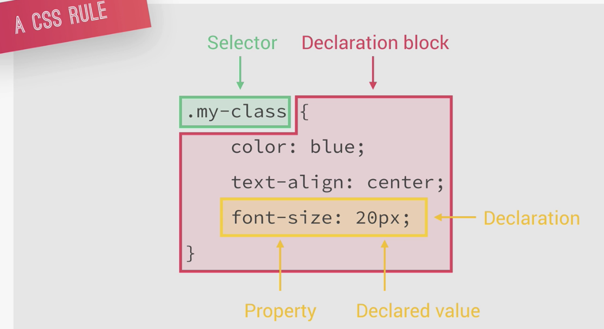

# Advanced CSS and Sass - Udemy

## By [Jonas Schmedtmann](https://www.udemy.com/course/advanced-css-and-sass/)

<h3 id='summary'>Summary</h3>

- [Advanced CSS and Sass - Udemy](#advanced-css-and-sass---udemy)
  - [By Jonas Schmedtmann](#by-jonas-schmedtmann)
    - [Normalize CSS](#normalize-css)
    - [Basic CSS](#basic-css)
          - [Background-image](#background-image)
          - [Clip-path](#clip-path)
          - [Keyframes Animations](#keyframes-animations)
        - [Three Pillars to Write Good HTML and CSS](#three-pillars-to-write-good-html-and-css)
    - [How CSS Works: behind the scenes](#how-css-works-behind-the-scenes)
    - [CSS Architecture Mindset](#css-architecture-mindset)
    - [SASS](#sass)
    - [Basic Responsive Design Principles](#basic-responsive-design-principles)
    - [Attribute Selectors](#attribute-selectors)

### Normalize CSS

[Summary](#summary)

Reset the css to make every browser to have the same basic css as you want. Nowadays, the browsers are much better, so a simple reset is enough.

```css
* {
    margin: 0;
    padding: 0;
    box-sizing: border-box;
}
```

Note. Never put font related css into the universal selector `*`. Put it on the body.

### Basic CSS

[Summary](#summary)

###### Background-image

[Summary](#summary)

You can add multiple background images, for example an image on the bottom and a gradient on top. To do this use the `background-image` property and define from the top to the bottom. Ex: `background-image: linear-gradient(to right bottom, rgba(126, 213, 111, 0.8), rgba(40, 180, 133, 0.8)), url('../images/hero.jpg');`.

###### Clip-path

[Summary](#summary)

With `clip-path` you can create a geometrical form to clip your image with.
```
                    1    2    3    4
clip-path: polygon(x y, x y, x y, x y);
where: 
1 = top left corner
2 = top right corner
3 = bottom right corner
4 = bottom left corner
Ex. triangle => clip-path: polygon(50% 0, 100% 100%, 0 100%);
Ex2. clip-path: polygon(0 0, 100% 0, 100% 75vh , 0 100%);
```
You can check this website [Clippy](https://bennettfeely.com/clippy/) to play with some forms and get the proper numbers.

###### Keyframes Animations

[Summary](#summary)

For browser perfomance is best to animate only 2 properties: `opacity` and `translate`, because the browsers are optimized for.

*Hack*: use `backface-visibility: hidden;` to fix the shaking at the end of the animation. Also, this is used for not showing the back of the element when animating it.


##### Three Pillars to Write Good HTML and CSS

[Summary](#summary)

1. Responsive Design - fluid layouts, media queries, responsive images, correct units, desktop-first vc mobile-first.
   
2. Maintainable and Scalable Code - code needs to be clean, easy to understand, growth, reusable, organized files, good name classes and good html structure.
   
3. Web Performance - make it faster and smaller in size. Less http request as possible, write less code, compress the code, use a CSS preprocessor, less images and compress images.


### How CSS Works: behind the scenes

[Summary](#summary)


So, as we can see above that is the basic structure to load a webpage in the browser.

CSS Rule has 2 parts:
1. selector
2. declaration block (property: declared value)



Cascade is the process of combining different stylesheets and resolving conflicts between different CSS rules and declarations, when more than one rule applies to a certain element. It resolves the conflicts by following the rule below:

`IMPORTANCE` ==> `SPECIFICITY` ==> `SOURCE ORDER`

Specificity is decided by:
1. Inline Styles
2. IDs
3. Classes, pseudo-classes, attribute
4. Elements, pseudo-elements

Value Processing in CSS 


Each CSS property has an initial value if nothing is declared, and if there is no inheritance.

Browsers specify a root font-size (usually 16px).

Percentages and relative values are always converted to pixels.

The `inherit` keyword forces inheritance on a certain property.

The `initial` keyword resets a property to its initial value.

**Visual Formatting Model** is an algorithm that calculates boxes and determines the layout of these boxes for each element in the render tree, in order to determine the final layout of the page. It takes into account:
1. Dimensions of the boxes: the box model

The Box Model:


2. Box type: inline, block, and inline-block


3. Positioning scheme: floats and positioning


4. Stacking contexts


5. Other elements in the render tree
6. Viewport size, dimensions of images, etc

### CSS Architecture Mindset

[Summary](#summary)

`Think` ==> `Build` ==> `Architect`

First think about the layout before writting code.
Then build your layout in HTML and CSS with consistent structure for naming classes, while also creating a logical architecture for CSS with files and folders.


**Component-Driven Design** is a principle used across all software developer. With this principle we try to divide the page into modular components. A modular building block that builds the layout of the page. It should also be reusable across a project and between different projects. For ex. create a library with your components and then use throughout your projects. The components should be independent, allowing them to be used anywhere on the page.

**BEM (Block Element Modifier)** is a system for creating meaningful classes names. It is usually written following the formula below:

```
.block {}
.block__element {}
.block__element--modifier {}
```

Where:
1. Block is a standalone component that is meaningful on its own
2. Element is part of a block that has no standalone meaning
3. Modifier is a different version o a block or an element

Ex. `.recipe {}`, `.recipe__stat {}`, `.recipe__stat--name {}`

**7-1 Pattern**

We have 7 different folders for partial Sass files and 1 main Sass file to import all other files into a compiled CSS stylesheet.

Ex.
```
base/
components/
layout/
pages/
themes/
abstracts/  ==> variables/mixins
vendors/ ==> 3rd party css
```

### SASS

[Summary](#summary)

SASS is a CSS preprocessor, an extension of CSS that adds power and elegance to the basic language.

SASS source code is **compiled** into CSS code.

Some of the features:
1. Variables
2. Nesting - nest selectors inside one another
3. Operators - mathematical operations inside CSS
4. Partial and imports - write in different files and import all to a single file at the end
5. Mixins - write reusable code
6. Functions - similar to mixins, but they can produce a value that can then be used
7. Extends - make different selectors inherit declarations that are common to all of them
8. Control Directives - for writing complex code using conditionals and loops (not going to be covered in the course)

What is the difference between Sass and SCSS?
They are basically different syntaxes.
The Sass it's the original one (Sass like language). It is indentation sensitive and doesn't use curly braces or semi-colons. 
While SCSS stands for sassy CSS. Preserves the way original CSS looks like.

Partial SASS files start with a `_` in their name. Ex. `_base.scss`

### Basic Responsive Design Principles

[Summary](#summary)

1. Fluid Grids and Layouts - allow content to easily adapt to the current viewport width used to browse the website. Uses % rather than px for all layout related lengths.
    - Float
    - Flexbox
    - Grid - 2 dimensions
    

2. Flexible/Responsive Images - images behave differently than content, and so we need to ensure that they also adapt nicely to the current viewport.
3. Media Queries - to change styles on certain viewport widths (breakpoints), allowing us to create different version of our website for different widths.

### Attribute Selectors

[Summary](#summary)

[class^="col-"] - selects all the elements that the attribute class starts with `col-`

[class*="col-"] - selects all the elements that the attribute class contains `col-`

[class$="col-"] - selects all the elements that the attribute class ends with `col-`


